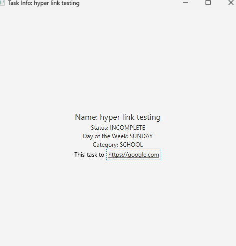

# 3500 PA05 Project Repo

[PA Write Up](https://markefontenot.notion.site/PA-05-8263d28a81a7473d8372c6579abd6481)

.jar download: https://drive.google.com/file/d/1db2O-FrkwKk8Wc0p3Jpm1tVw7BXayn9Q/view?usp=sharing

Feature / GUI images 

Image Attribution

Mew in Menu: Pokemon
Miffy in Menu: Dick Bruna
White Bear / Stars in between File and Theme: Hand Drawn (Sophia Ortiz)
Miffy in WeekView: Dick Bruna
Rilakkuma : San-x

Pitch:
Introducing the Ultimate Bullet Journal Application

Get your life organized and creativity flowing with our JavaFX bullet journaling application. This is not just a task manager or a daily planner; it's your personal digital diary, calendar, task manager, and creative outlet, all in one place.

Our application offers a structured yet customizable Week View where you can see all your tasks and events for the week at a glance. The Event and Task Creation feature allows you to effortlessly add, edit, or delete your commitments for each day. Worry no more about forgotten obligations with our Commitment Warnings feature which alerts you when deadlines are approaching. Plus, your progress won't be lost as the Persistence feature ensures all your data is saved and easily retrievable.

Dive deeper into personalization with our Headlining Features. The Categories feature allows you to assign specific categories to your tasks and events, so you can streamline your tasks according to your priorities. The Themes feature provides various aesthetic options to make your bullet journaling experience truly unique and reflective of your style.

Experience a power-packed boost with our Power Ups. The Quotes & Notes feature enables you to add inspirational quotes or important notes to your journal. The Mini-viewer gives you a quick, concise view of your tasks and events, while the Weekly Overview provides a broader perspective of your weekly commitments and tasks.

Take your bullet journaling to the next level with our Quality of Life enhancements. The Links feature allows you to add hyperlinks to your tasks and notes, connecting your journal with the vast digital universe. You can also set your preferred Week Start day for a tailored weekly view.

Finally, the Extra Credit features. The Deployable Application allows you to take your bullet journal with you anywhere you go. Impress everyone with your stylish bullet journal with our Visual Flourish and Splash Screen features. Maintain your privacy and protect your personal notes with our Privacy Lock feature.

Life can be hectic, but organizing it doesn't have to be. Embrace the creativity and productivity of bullet journaling with our JavaFX application. It's time to make every week count, beautifully!

New Feature:
Incorporating a feature that allows users to visualize their data through graphs could be an invaluable extension to our bullet journaling application. This feature would not only facilitate better understanding of a user's time management but also provide a vivid depiction of their productivity trends over time.

Implementation of such a feature would involve the following steps:

Graph Creation: Next, we would have to design and implement a GraphGenerator class that takes in the data from DataCollector and constructs visual representations. Depending on the type of graph required (bar, pie, line, etc.), this class would generate the appropriate graph using JavaFX's charting libraries. Each graph type could be a separate subclass of GraphGenerator, following the Factory design pattern.

UI Integration: This step involves integrating the graph feature into the user interface. Users could access this feature through a button or tab labelled "My Stats" or "Data Visualizer", which would take them to a new screen displaying various graphs based on their activity. The graphs should be interactive to some extent, allowing users to choose the time period (day, week, month, year) for which they want to see their data.

Testing and Refinement: Finally, we would need to test the feature thoroughly to ensure it works correctly and provides value to the user. We would make sure that the graphs accurately reflect the logged data and update in real-time as the user adds or completes tasks.

By adding a graph visualization feature, our bullet journal application could offer users greater insight into their habits and productivity, enabling them to make more informed decisions about their time management. It would truly take our application from a simple task tracker to a powerful personal productivity analysis tool.

SOLID:
Single Responsibility Principle (SRP): We applied SRP by ensuring that each class and interface in our project has a single responsibility and reason to change. For example, the JournalControllerImpl class is responsible for controlling the journal application, handling user interactions, and updating the view accordingly. This separation of concerns makes the code easier to understand, maintain, and test.

Open/Closed Principle (OCP): We applied OCP by designing our classes and interfaces to be open for extension but closed for modification. We achieved this by using abstraction and interfaces, allowing new types of views, controllers, and models to be added without modifying the existing code. For example, the JournalView interface allows different implementations of views, such as JournalGuiView, to be created and used interchangeably with the existing controller implementations.

Liskov Substitution Principle (LSP): We applied LSP by ensuring that objects of the derived classes can be substituted for objects of the base class without affecting the correctness of the program. For example, the JournalController interface defines the common behavior for different types of controllers, and the JournalControllerImpl class implements that behavior while extending it with additional functionality. This allows any implementation of the JournalController interface to be used wherever a controller is required.

Interface Segregation Principle (ISP): We applied ISP by designing fine-grained interfaces that are specific to the needs of the clients. For example, the JournalController interface only includes methods related to controlling the journal application, while the JournalView interface only includes methods related to loading the view. This allows the clients to depend only on the interfaces they need, preventing them from being forced to depend on unnecessary methods.

Dependency Inversion Principle (DIP): We applied DIP by depending on abstractions rather than concrete implementations. For example, the JournalGuiView class depends on the JournalController interface, which allows different implementations of controllers to be used with the view. This decoupling of dependencies enables flexibility, extensibility, and easier testing and maintenance of the code.